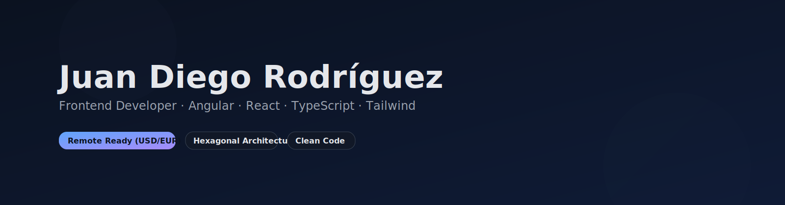

<!--
  GitHub Profile · Juan Diego Rodríguez
  Professional, clean, and visually engaging profile with custom banners and sections.
-->

<p align="center">
  
</p>

<p align="center">
  <a href="mailto:rodriguezjuandy@gmail.com"><strong>Email</strong></a> •
  <a href="https://www.linkedin.com/in/juanrodriguezadev/"><strong>LinkedIn</strong></a> •
  <a href="https://github.com/juanrodriguezadev"><strong>GitHub</strong></a>
</p>

<p align="center">
  <em>Clean Code · Modern UX · Scalable Frontend</em>
</p>

<p align="center">
  
</p>

<h3 align="center">Frontend Web Developer (Angular · React · TypeScript) — Remote Ready</h3>

<p align="center">
  I specialize in building <strong>modern, scalable, and high-performing web applications</strong> using Angular and React, with a strong focus on user experience, maintainability, and clean architecture.
</p>

---

## 🧭 About Me
- 🌎 Based in Colombia · Open to **remote opportunities (USD/EUR)**
- 💻 Main stack: **Angular (v10+), React, TypeScript, JavaScript, TailwindCSS, Angular Material, Fuse**
- 🧱 Architectures: **Hexagonal · Domain Driven Design · Clean Code**
- ☁️ Cloud: **AWS (CloudFront, S3, EC2)** · CI/CD workflows
- 🎨 Design/UI: **Figma, Balsamiq, Prototyping**
- 🤝 Enthusiastic about teamwork, agile methodologies, mentoring, and developer experience

---

## 🛠 Tech Stack
<p>
  
  
  
  
  
  
  
  
  
  
  
  
  
</p>

<p align="center">
  
</p>

---

## 🚀 Experience

- **Akorbi S.A.S (2020 – 2025)** · Frontend Web Developer  
  Angular/React modular development, API integrations, mock creation & validation, interface optimization, unit testing.

- **SETI S.A.S (2022 – 2024)** · Frontend Web Developer Semi Senior  
  Angular/React with hexagonal architecture, AWS deployments, UI/UX design in Figma, CI/CD pipelines, agile teamwork.

- **Current role (2024 – Present)** · Frontend Web Developer Semi Senior  
  Building scalable applications, implementing clean architecture, advanced Angular patterns, and UX-focused features.

---

## 📂 Featured Projects

<table>
  <tr>
    <td width="50%" valign="top">
      <h3>Talent & Learning Platform</h3>
      <p>
        A full-stack HRTech solution for talent and learning management, built with Angular + Hexagonal Architecture.
        Includes courses, learning paths, organizational teams, and integrated AI chatbot.
      </p>
      <ul>
        <li>Domain / Ports / Infrastructure layered architecture</li>
        <li>Modern UI with Tailwind + Fuse</li>
        <li>Sections, resources with estimated time, drawers, drag & drop</li>
      </ul>
      <p><em>Private repo — demo available on request</em></p>
    </td>
    <td width="50%" valign="top">
      <h3>Knowledge Base Chatbot</h3>
      <p>
        Conversational chatbot interface with memory and <strong>citation insights</strong>.  
        Adaptive UX: expandable sources inline or via drawer depending on count.
      </p>
      <ul>
        <li>Custom citation-viewer organism</li>
        <li>Integration with OpenAPI backend · Multi-language support</li>
        <li>Focus on accessibility and clean UX</li>
      </ul>
      <p><em>Private repo — demo available on request</em></p>
    </td>
  </tr>
</table>

---

## 🧪 Code Sample (Angular)
```ts
// Example: safe API call with RxJS, state handling & error management
loadCourses(): void {
  this.loading.set(true);
  this.courses$ = this.courseService.getCourses().pipe(
    finalize(() => this.loading.set(false)),
    catchError(err => {
      this.toast.error('Failed to load courses');
      return of([]);
    })
  );
}
