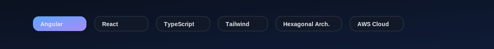

<!--
  GitHub Profile · Juan Diego Rodríguez
  Professional, clean, and visually engaging profile with local SVG banners (./assets/*).
-->

<p align="center">
  
</p>

<p align="center">
  <a href="mailto:rodriguezjuandy@gmail.com"><strong>Email</strong></a> ·
  <a href="https://www.linkedin.com/in/juanrodriguezadev/"><strong>LinkedIn</strong></a> ·
  <a href="https://github.com/juanrodriguezadev"><strong>GitHub</strong></a>
</p>

<p align="center">
  <em>Clean Code · Modern UX · Scalable Frontend</em>
</p>

<p align="center">
  
</p>

<h3 align="center">Frontend Web Developer (Angular · React · TypeScript) — Remote Ready</h3>

<p align="center">
  I build <strong>modern, scalable and high-performing web apps</strong> with Angular/React, TypeScript, Tailwind and
  Hexagonal Architecture — with a strong focus on UX, performance and maintainability.
</p>

---

## 🧭 About Me
- 🌎 Based in Colombia · Open to **remote opportunities (USD/EUR)**
- 💻 Main stack: **Angular (v10+), React, TypeScript, JavaScript, TailwindCSS, Angular Material, Fuse**
- 🧱 Architectures: **Hexagonal · Domain-Driven Design · Clean Code**
- ☁️ Cloud & tooling: **AWS (CloudFront, S3, EC2)**, CI/CD basics, GitHub
- 🎨 Design/UI: **Figma, Balsamiq, rapid prototyping**
- 🤝 I enjoy code reviews, performance tuning, DX, and mentoring

---

## 🛠 Tech Stack
<!-- Reliable, clean icons (dark-mode friendly) -->
<p align="left">
  <a href="https://skillicons.dev">
    
  </a>
</p>

<!-- Optional decorative skills banner -->
<p align="center"></p>

<p align="center">
  
</p>

---

## 💼 Experience

- **Akorbi S.A.S** — Frontend Web Developer  
  <sub>2020 – 2025</sub>  
  Modular development in Angular/React, API integrations, mocks & Postman validation, interface optimization, and unit testing.

- **SETI S.A.S** — Frontend Web Developer (Semi-Senior)  
  <sub>Jan 2022 – Jun 2024</sub>  
  Angular/React with Hexagonal Architecture, AWS deployments, UI/UX design in Figma, CI/CD workflows, agile collaboration.

- **Current Role** — Frontend Web Developer (Semi-Senior)  
  <sub>Jun 2024 – Present</sub>  
  Building scalable features with Angular/React, clean architecture and UX-focused components; improving performance and DX.
  
> *If you’d like more details about responsibilities, results, or code samples, I can provide private demos on request.*

---

## 🚀 Featured Projects

<table>
  <tr>
    <td width="50%" valign="top">
      <h3>Talent & Learning Platform</h3>
      <p>
        HRTech solution for talent and learning management, built with <strong>Angular + Hexagonal Architecture</strong>.
        Modules for courses, learning paths, organizational teams, and an AI-powered chatbot.
      </p>
      <ul>
        <li>Layered design: <em>domain → ports → infrastructure</em></li>
        <li>Modern UI with Tailwind + Fuse; responsive drawers and summaries</li>
        <li>Sections & resources with estimated time, drag & drop ordering</li>
      </ul>
      <p><em>Private repo — demo screens available on request</em></p>
    </td>
    <td width="50%" valign="top">
      <h3>Knowledge Base Chatbot</h3>
      <p>
        Conversational interface with memory and <strong>citation insights</strong>.
        If there are 3+ sources, a drawer opens; otherwise, sources expand inline for a clean UX.
      </p>
      <ul>
        <li>Custom <code>citation-viewer</code> organism with visual mapper</li>
        <li>OpenAPI integration · multilingual support</li>
        <li>Accessibility and performance improvements</li>
      </ul>
      <p><em>Private repo — demo screens available on request</em></p>
    </td>
  </tr>
</table>

---

## 🧪 Code Sample (Angular)
```ts
// Safe API call with RxJS, typed streams, and error handling
loadCourses(): void {
  this.loading.set(true);
  this.courses$ = this.courseService.getCourses().pipe(
    finalize(() => this.loading.set(false)),
    catchError(err => {
      this.toast.error('Failed to load courses');
      return of([]);
    })
  );
}
